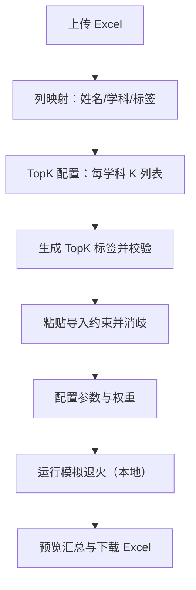

## 1. 产品概述
一个部署在 GitHub Pages 的纯前端分班网页：上传 Excel，选择成绩列与标签列（含 TopK 自动标签），录入约束，运行与“最终程序.py”一致的模拟退火分班，并导出结果 Excel。
- 目标用户：任意需要按成绩/标签均衡分班的老师或管理员
- 核心价值：无需安装环境、不上传数据到服务器、可配置且可复现的分班优化与标准化导出

## 2. 核心功能

### 2.1 用户角色
本产品不区分角色，所有访问者均可使用全部功能（纯前端、无账号体系）。

### 2.2 功能模块
1. **数据导入与字段映射**：上传 Excel、选择姓名列、选择学科成绩列、选择标签列（0/1 或枚举展开）
2. **TopK 标签生成**：对每门学科输入一组 K，按“包含并列”的规则自动生成 TopK 标签列并纳入优化
3. **约束管理**：粘贴文本批量导入（必须同班/不在同班/固定班级），对重名进行交互消歧
4. **参数配置**：班级数、退火参数、权重（学科与标签统一权重向量）、惩罚强度（硬约束/软惩罚统一框架）
5. **运行与可视化**：启动优化、显示进度与当前/最优评分、展示各班均值与标签分布预览
6. **结果导出**：下载 Excel（分班结果 + 分班成绩/分布汇总），包含可追溯的参数与约束摘要

### 2.3 页面详情
| 页面名称 | 模块名称 | 功能描述 |
|---|---|---|
| 单页应用（/） | 顶部流程导航 | 导入 → 映射 → 约束 → 参数 → 运行 → 导出 分段式向导 |
| 单页应用（/） | 文件上传与预览 | 支持 .xlsx/.xls；展示前 N 行预览与列名 |
| 单页应用（/） | 列映射配置 | 选择姓名列；多选学科成绩列；选择标签来源（0/1 多列、枚举展开）；自动校验缺失值/非数值 |
| 单页应用（/） | TopK 配置 | 每门学科独立输入 K 列表（如 10,20,50）；支持校验 K 合法性；生成 TopK 标签并预览计数 |
| 单页应用（/） | 约束导入 | 粘贴文本 → 解析 → 校验 → 消歧 → 入库；展示可编辑列表 |
| 单页应用（/） | 参数配置 | 班级数；退火参数；权重向量；硬约束惩罚系数；运行按钮 |
| 单页应用（/） | 运行面板 | 进度条、温度轮次、接受率、最优分数；随时停止；运行后展示汇总表 |
| 单页应用（/） | 导出面板 | 一键下载 Excel；包含“学生分班”“各班学科均值”“各班标签人数”“统计汇总”“参数与约束” |

### 2.4 性能与可用性目标
- 典型规模：350 人、8 班、学科若干、标签若干（含 TopK 标签）
- 运行体验：计算在浏览器本地执行，默认使用 WebWorker，页面保持可操作
- 可中断：运行中可停止并保留当前最优解
- 可复现：导出 Excel 附带参数与约束快照，便于复跑对比

## 3. 核心流程
1. 用户打开网页，上传 Excel
2. 选择姓名列、学科成绩列、标签列（或选择枚举列并展开）
3. 为每门学科输入 K 列表，生成 TopK 标签
4. 粘贴导入约束文本，处理重名与错误提示
5. 设置班级数、权重与模拟退火参数，点击开始
6. 浏览器本地运行优化（默认在 WebWorker 中），得到最优分班
7. 下载结果 Excel

## 4. 用户界面设计

### 4.1 设计风格
- 视觉基调：学术工具风格（清晰、可靠、可审计），强调数据密度与可读性
- 主色：深蓝灰作为主色，强调色用于“开始/停止/下载”
- 字体：优先选择可读性强的中文无衬线字体；数字采用等宽或近似等宽以便对齐
- 布局：桌面优先的左右分栏（左：配置，右：预览/运行），小屏自动变为上下布局
- 交互：关键步骤提供校验提示与不可逆操作确认（如清空约束、重置参数）

### 4.2 页面设计概览
| 页面名称 | 模块名称 | UI 元素 |
|---|---|---|
| 单页应用（/） | 向导导航 | 分段步骤条、当前步骤高亮、未完成步骤标记 |
| 单页应用（/） | 数据预览 | 表格预览、列名高亮、类型提示（数值/文本/枚举） |
| 单页应用（/） | 约束导入 | 文本框、解析结果表、错误行标注、重名选择弹窗 |
| 单页应用（/） | 运行面板 | 温度轮次日志折叠区、进度条、停止按钮、结果卡片 |

### 4.3 响应式
- 桌面优先
- 平板/手机：配置面板折叠；预览表格支持横向滚动；按钮与输入框触控优化
