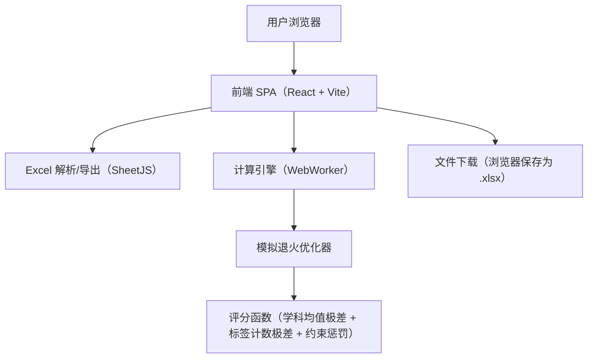

## 1. 架构设计

说明：
- 纯前端：不引入后端与数据库；所有数据与计算均在本地完成
- 计算隔离：默认在 WebWorker 中运行模拟退火，避免 UI 卡顿；主线程仅负责交互与可视化

## 2. 技术选型说明
- 前端：React@18 + TypeScript + Vite
- UI：轻量组件 + 自定义样式（避免复杂依赖；可按需要引入 Headless 组件方案）
- Excel：SheetJS（xlsx）用于读取与生成工作簿
- 计算：WebWorker + 结构化克隆传输；必要时采用 TypedArray 降低开销
- 部署：GitHub Pages（静态资源托管）

## 3. 路由定义
| 路由 | 用途 |
|---|---|
| / | 单页应用：导入、配置、运行、导出 |

## 4. 核心数据结构（前端内存模型）

### 4.1 表格与字段映射
- `RawRow`: 从 Excel 读取的一行原始数据（键为列名）
- `MappingConfig`:
  - `nameColumn: string`
  - `subjectColumns: string[]`
  - `labelColumns01: string[]`（0/1 标签列）
  - `enumLabelColumns: string[]`（枚举标签列，自动展开，空白不展开）
  - `topKBySubject: Record<string, number[]>`（每门学科各自的 K 列表）

### 4.2 优化输入（对应“最终程序.py”）
- `Student`:
  - `name: string`
  - `scores: number[]`（长度 = subject_num）
  - `categories: number[]`（0/1 向量，长度 = category_num）
  - `classIndex: number`（内部使用 0..class_num-1）
- `Constraint`（与最终程序.py 语义对齐）：
  - `type: 1 | 2 | 3`（1必须同班 / 2必须不同班 / 3固定班级）
  - `a: number`（学生索引）
  - `b: number`（学生索引或固定班级索引）

### 4.3 输出模型
- `ResultWorkbook`（SheetJS 工作簿）
  - Sheet1：学生分配详情（姓名、学科分、标签、班级）
  - Sheet2：各班学科平均分
  - Sheet3：各班各标签人数
  - Sheet4：分布统计汇总（每学科均值极差、每标签人数极差）
  - Sheet5：参数与约束（用于审计与复现）

## 5. 评分函数与优化实现要点

### 5.1 评分函数（与“最终程序.py”一致）
- 学科均衡：对每门学科 j，按班级计算均值 `avg[c][j]`，取极差 `range`，累加 `((range*10)^2)*weight[j]`
- 标签均衡：对每个标签 k，按班级统计人数 `count[c][k]`，令 `total=sum(count)`，取极差 `range`，累加 `(((range^2/total*RAT_DIST)^2))*weight[subject_num+k]`
- 约束惩罚：违反一次加 `penaltyHard`（默认 300，可配置，且可远大于其他项以近似硬约束）

### 5.2 模拟退火（与“最终程序.py”一致）
- 初始分配：按学生序号轮流分配 `i % class_num`，保证各班人数差≤1
- 邻域：随机选取两名不同班学生交换班级（人数严格保持均衡）
- 接受：`delta<=0` 必收；否则以 `exp(-delta/T)` 接受；每轮后 `T *= cooling_rate` 直到 `T <= end_temp`

### 5.3 增量评估（目标函数不变，仅加速计算）
为保证 350 人在浏览器内可用，前端实现采用“增量更新”，但评分函数数学形式与“最终程序.py”保持一致。
- 维护缓存（随解变化）：
  - `classSizes[c]`
  - `classScoreSums[c][j]`
  - `classLabelCounts[c][k]`
- 每次交换仅更新两班的上述缓存，并对每个维度（学科/标签）在 `class_num` 个班里重新取一次 `min/max`（8 班时开销很小）
- 约束惩罚增量化：
  - 预先把约束整理为“按学生索引的邻接表”
  - 交换 A、B 时，仅重算与 A 或 B 相关的约束项（而不是扫全体约束）

### 5.4 TopK 标签生成规则（自动化）
- 对每门学科、每个 K：
  - 计算该学科分数从高到低排序
  - 取“第 K 名分数阈值”（若 K 超过人数则阈值为最低分）
  - 标签条件：`score >= threshold`（包含并列，可能导致数量 > K）
- 生成的每个 TopK 标签作为一个类别维度参与“标签均衡”惩罚

## 6. 约束文本导入协议（建议）

为满足“按我给的来”，默认支持以下三种行格式（逗号分隔，忽略首尾空格）：
1. `姓名A,姓名B,不在同班`
2. `姓名A,姓名B,必须同班`
3. `姓名A,固定班级,班级编号`（输出为 1..N；内部会转换为 0..N-1）

解析与校验策略：
- 找不到姓名：标红并提示可能的拼写/空格差异
- 重名：弹窗要求从候选行中选择具体学生（会显示该行的学科分用于辅助辨认）
- 班级编号越界：提示有效范围 1..class_num

## 7. 性能与可用性策略（350 人/8 班）
- 默认启用 WebWorker：主线程保持流畅，结果通过消息回传
- 迭代参数可调：提供“更快/更稳”预设，同时允许手动输入（iterations、initial_T、cooling_rate、end_temp）
- 复杂度特征：总耗时基本与“尝试交换次数”线性相关；在增量评估下单次交换开销与 `subject_num + category_num` 成正比
- 可中断：提供“停止”按钮（Worker 端定期检查取消标记）
- 可复现：导出 Excel 附带所有参数与约束文本快照
